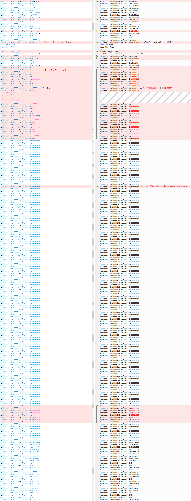

# 内存重构部署文档

[内存重构实现原理解析](Review.md)

## 宿主机

### volatility需要安装的包

[volatility github](https://github.com/volatilityfoundation/volatility/wiki/Installation)

1. **python 2.7**
    - sudo pip install py-bcrypt
    - sudo pip install utils
    - sudo apt-get install python-tk
2. **distorm3**
    - [参考官方文档](https://github.com/gdabah/distorm/releases)
    - sudo python setup.py build
    - sudo python setup.py install
3. **pycrypto-2.6.1**
    - [参考官方文档](https://www.dlitz.net/software/pycrypto/)
    - sudo apt-get install python-dev
    - sudo python setup.py build
    - sudo python setup.py install
4. **yara**
    - [参考官方文档](https://yara.readthedocs.io/en/v3.7.0/gettingstarted.html)
5. **jpype**
    - [参考官方文档](https://github.com/originell/jpype/releases)
6. **setuptool**
    - pip install setuptool
7. **elftools**
    - pip install pyelftools
8. **paramiko**
    - pip install paramiko
9. **libvmi-0.10.1**
    - *建议下载 libvmi-0.10.1 版本 其他版本编译有问题*
    - [官方文档](https://github.com/libvmi/libvmi)
    - ./autogen.sh
    - sudo apt-get install libgnomeui-dev
    - sudo apt-get install check-devel
    - sudo apt-get install libvirt-dev
    - ./configure --enable-xen=no
    - make
    - sudo make install
    - cd tools/pyvmi/
    - sudo python setup.py build
    - sudo python setup.py install
    - ldconfig

## 虚拟机

1. [**安装jdk 配置jdk**](https://blog.csdn.net/rflyee/article/details/8989663)
2. 分析Java程序需导入
   - pyagent.jar
   - Test.jar
3. 分析C程序需导入
   - buffer_overflow_attack文件夹

## 工程相关（宿主机端）

1. pyCharm运行程序
    - 遇到错误提示 ImportError: libvmi-0.9.so: cannot open shared object file: No such file or directory
    - 在环境变量/etc/profile.d/jdk.sh 中添加 export LD_LIBRARY_PATH=$LD_LIBRARY_PATH:/usr/local/lib
2. 在 `JavaMemory/volatility-2.6/volatility/plugins/linux` 路径下
   - `linux_runtime_py` 用于分析Java程序
   - `linux_memory_analyze.py` 用于分析C程序
3. `linux_runtime.py` 中需要修改的路径有：

    | 变量名          | 默认值                |
    | --------------- | ------------------- |
    | j_test_path     | -Djava.class.path=/home/kong/JavaMemory/JDI/out/artifacts/JDI_jar/JDI.jar |
    | symbol          | /home/kong/JavaMemory/jdk1.7.0_79/jre/lib/amd64/server/libjvm.so          |
    | self.symbolDict | /home/vm/jdk1.7.0_79/jre/lib/amd64/server/libjvm.so                       |
4. `linux_memory_analyze.py` 中需要修改的地方有：

    | 变量名       | 默认值          |
    | ----------- | -------------- |
    | calculate 函数中 processname | ./stack 需要修改为分析的C程序名称 |

5. JDI工程需要导入包

- `jdk1.7.0_79/lib/sa-jdi.jar`
- `JavaMemory/JDI.jar`

IDEA中打JDI包方法[参考](https://www.jianshu.com/p/2e06dd2ea4da)，要将官方`JDI.jar`、`sa-jdi.jar` Extracted Directory到项目中

## 测试环境

- **测试volatility是否可以获取到虚拟机信息**
  - volatitlity工程 Pycharm配置参数（如果虚拟机为64位） `-l vmi://ubuntu --profile=LinuxUbuntu1604_内核版本号x64 linux_pslist`
  - （如果虚拟机为32位） `-l vmi://ubuntu12.04_32bit --profile=LinuxUbuntu1204_23x86 linux_pslist`
  - 其中 `vmi` 代表虚拟机名称，`profile` 代表在虚拟机内部打包生成的profile名称，`x64、x86` 代表虚拟机位数
  - 若未显示虚拟机进程信息，可能虚拟机内核版本与overlays目录下的压缩包不匹配 虚拟中通过 `uname -a` 查看内核版本 并执行以下步骤生成profile，可参考[官方文档](https://github.com/volatilityfoundation/volatility/wiki/Linux)（虚拟机中）：
    1. 将volatility工程拷到虚拟机中
    2. `sudo apt-get install dwarfdump`
    3. `sudo apt-get install build-essential`
    4. 建议禁止内核自动升级，设置中停止更新，并 `sudo apt-mark hold 内核版本号`
    5. `cd volatility/tools/linux 并 make`
    6. `head module.dwarf`
    7. `sudo zip volatility-2.6/volatility/plugins/overlays/linux/Ubuntu系统版本号_内核版本号.zip volatility-2.6/tools/linux/module.dwarf /boot/System.map-内核版本号`
    8. 将生成的zip文件拷到宿主机的 `volatility-2.6/volatility/plugins/overlays/linux`目录下 并修改参数

## 运行流程

### 分析Java程序

1. 虚拟机执行命令 `java -jar -Xint Test.jar` 运行测试程序
2. 虚拟机另开终端 执行命令jps 获取jar对应的 `线程号` 并执行命令 `sudo java -jar pyagent.jar 线程号`
3. 宿主机 添加配置参数为 `-l vmi://ubuntu --profile=LinuxUbuntu1604_内核版本号x64 linux_runtime -p 测试程序进程号` 并运行

### 分析C程序

1. 虚拟机执行命令 `./stack` 运行测试程序
2. 宿主机 添加配置参数为 `-l vmi://ubuntu12.04_32bit --profile=LinuxUbuntu1204_内核版本号x86 linux_memory_analyze -p 测试程序进程号` 并运行

如果提示 `waiting connection...` 即 该volatility 工程为socket服务端，等待IOT工程作为客户端的连接

## JDI

此文件夹是通过 Volatility 进行内存分析时，jpype调用的java接口实现

## JDI_Local

此文件夹是本地进行Java内存分析的代码，运行流程为：

- root权限打开该工程
- 添加 `jdk1.7/lib/sa-jdi.jar` 到工程中
- 使用1.7版本java 运行的测试程序，cd到jdk1.7 bin目录下，`./java -jar -Xint path/of/test.jar`
- jps获取测试程序进程号，并修改工程中的cmd变量值
- **测试程序需要sleep一下，否则 Volatility 框架无法获取内存信息**

## [buffer-overflow-attack](https://github.com/theChildinus/buffer-overflow-attack)

图片中左侧为缓冲区溢出攻击前的堆栈情况，右侧为攻击后的堆栈情况

## Q & A

1. 推荐阅读：
    - [HotSpot Serviceability Agent 实现浅析](https://yq.aliyun.com/articles/20231)
    - [JVM 内存模型概述](https://blog.csdn.net/justloveyou_/article/details/71189093)
    - [doc Serviceability Agent](https://docs.oracle.com/javase/jp/8/docs/serviceabilityagent/)
    - [x86-64 下函数调用及栈帧原理](https://zhuanlan.zhihu.com/p/27339191)
