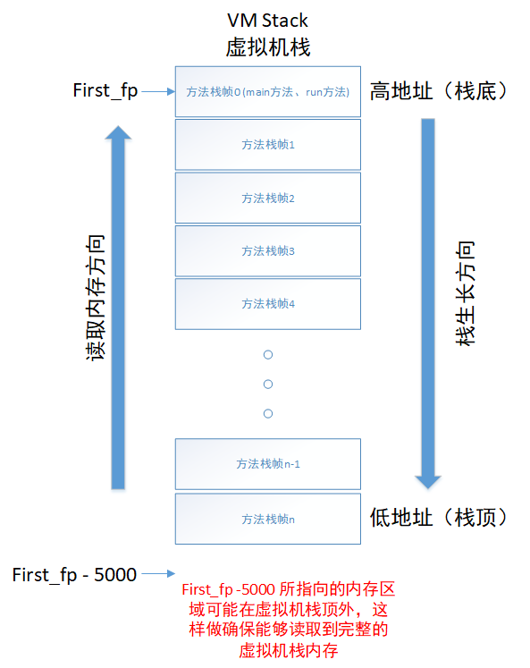

# Review v2

## **工程：内存重构分析**

[MemoryAnalyse - 工程地址](https://github.com/theChildinus/JavaMemory)

### **必备知识**

1. Java、Python编程基础
2. Volatility 实现原理及自带工具，安装和部署
3. libvmi 原理及功能
4. JVM 内存模型，堆栈分配
5. Java多线程编程基础
6. 基于C程序的缓存区溢出攻击原理及实现 - [参考工程: buffer-overflow-attack](https://github.com/theChildinus/buffer-overflow-attack)
7. 本地分析Java程序堆栈信息 - [参考工程：JDI_Local](https://github.com/theChildinus/JavaMemory/tree/master/JDI_Local)
8. Serviceability Agent 原理

### **遇到过的问题和理解**

#### 1. `Volatility` 框架是如何对虚拟机进行内存分析（取证）的？

先理解以下三个框架、库的作用：

- `volatility` 是用来将内存语义重构
- `libvmi` 是一个虚拟机自省库，用来访问运行虚拟机的内存的
- `pyvmi` 是基于 `libvmi` 的，使用 `pyvmi` 必须先安装`libvmi` 。`libvmi` 提供C语言接口，而 `pyvmi` 提供的是python接口，这样就可以方便的与其他使用python的工具连接。将 `volatility` 配合 `pyvmi` 使用，就可以直接重构运行虚拟机的内存，而不用转储成文件后再重构

在Linux系统中，所有的进程是通过链表来管理的，对于每一个进程都有一个进程描述符 `task_struct`，其中包含了当前进程的所有信息。在系统启动初期链表中只有 `init_task` 这一个进程，它是内核的第一个进程，由于其在linux系统中的特殊性，可以再内核符号表中查找到它的逻辑地址，然后我们通过遍历进程链表便可以找到目标进程。

Linux中记录内核符号表的文件分为两各部分，首先是静态部分，也就是内核文件映像 `vmlinux` 部分的符号表，另外一部分是Linux可配置部分的符号表，两者分别对应 `/proc/ksyms` 和 `System.map` 这两个文件，其中 `System.map` 文件记录了 `init_task` 进程的逻辑地址，想要获取进程的详细信息我们还需要知道 `task_struct` 的结构，在Linux中，`kernel-header` 源码通过 `dwarfdump` 生成的 `module.dwarf` 文件中会包含很多内核数据结构，这个文件和 `System.map` 被我们一起打包在 `profile` 中供 `Volatility` 框架使用

在 `Volatility` 框架中，所有插件程序的入口位置是：

```python
def render_text(self, outfd, data):
    ...
```

 `linux_runtime.py` 中获取虚拟机中指定程序的进程如下：

```python
def allprocs(self):
    linux_common.set_plugin_members(self)
    # 获取linux 内核第一个进程 0号进程 init_task
    init_task_addr = self.addr_space.profile.get_symbol("init_task")
    init_task = obj.Object("task_struct", vm=self.addr_space, offset=init_task_addr)

    # walk the ->tasks list, note that this will *not* display "swapper"
    # 遍历进程链表 使用yield 每次调用allprocs函数返回下一个进程
    for task in init_task.tasks:
        yield task

#依次获取进程 直到获取指定进程
def calculate(self):
    linux_common.set_plugin_members(self)
    process_name = "java"
    tasks = []
    for task in self.allprocs():
        # task.comm 包含了进程的名称 我们指定分析java程序
        if str(task.comm) in process_name:
            tasks.append(task)
    tasks.sort()
    return tasks

...

def render_text(self, outfd, data):
    ...
    tasks = self.calculate()
    if len(tasks) > 0:
            task = tasks[-1]
            print "task.pid is ", task.pid
    ...
```

在此工程中，我们分析的目标程序是Java程序，首先我们可以通过 `Volatility` 框架获取到运行目标程序的JVM进程信息。

其次对于任何一个Java程序，我们可以使用 `Serviceability Agent`（sa-jdi.jar） 中提供好的类、接口去分析Java程序的堆栈信息（这正是我们想要的， `jstack`，`jmap` 等命令也是在 `Serviceability Agent` 中实现的，它们为我们提供了很好的解决思路）。

所以我们自然而然的萌生了在 `Volatility` 框架中调用 `Serviceability Agent` 接口去获取分析栈帧，在 `Serviceability Agent` 具体实现中调用 `Volatility` 已经获取到的进程信息进行初始化的想法，但是 `Volatility` 框架是使用Python开发的，`Serviceability Agent` 是使用Java开发的，所以引出了问题：如何在Python程序中调用Java，如何在Java程序中调Python?

这里我们引入 `JPype`，`JPype` 是一个能够让 `python` 代码方便地调用 `Java` 代码的工具，从而克服了 `python` 在某些领域中的不足，对应到代码中：

```python
# JPype 提供的 startJVM() 函数的作用是启动 JAVA 虚拟机，所以在后续的任何 JAVA 代码被调用前，必须先调用此方法启动 JAVA 虚拟机。
j_test_path = '-Djava.class.path=/home/kong/JavaMemory/JDI/out/artifacts/JDI/JDI.jar'
jpype.startJVM(jpype.getDefaultJVMPath(), j_test_path)
```

为了使用 `Serviceability Agent` 中已经的实现类、接口去分析 `Volatility` 获取的目标程序，我们就需要替换 `Serviceability Agent` 初始化时所需的JVM信息为 `Volatility` 提供的（默认分析的是本地程序，调用本地Native方法，强烈建议阅读 [Serviceability Agent解析](https://yq.aliyun.com/articles/20231)），这些JVM信息包括：

- `libnames` 共享库名称
- `libbases` 共享库起始地址
- `threadsId` 所有子线程id
- 方法 `lookUpByName` 根据符号名称在共享库中查找符号在内存的地址
- 方法 `readBytesFromProcess` 利用地址内存获取模块，根据地址和大小读取内存返回 `byte` 类型数组的内存数据

`linux_runtime.py` 中获取这些JVM信息的实现为：

```python
libnames = [] # 共享库名称
libbases = [] # 共享库起始地址
libs = []
name_set = set()
# 获取共享库函数在进程中的虚拟地址映射
# vma 虚拟内存空间
# get_proc_maps方法 可以获取到进程的内存映射，其中包括了进程加载的共享库的名称和映射的内存地址
# 这些库的名称和起始地址可以计算出JVM内存结构的变量和常量在内存中的地址
for vma in task.get_proc_maps():
    fname = vma.vm_name(task)
    if fname == "Anonymous Mapping":
        fname = ""
    if len(fname) > 0 and fname not in name_set:
        name_set.add(fname)
        lib = Library()
        lib.base = vma.vm_start
        lib.name = fname
        libnames.append(str(lib.name))
        libbases.append(long(lib.base))
        libs.append(lib)

for lib in libs:
    if ".so" in lib.name or "java" in lib.name:
        print "base:", hex(lib.base), "name:", lib.name
# 获取子线程tid
threadsId = []
for thread in task.threads():
    threadsId.append(long(thread.pid))

...

def getThreadsId(self):
        return self.threadsId

def getLibName(self):
    return self.libnames

def getLibBase(self):
    return self.libbases

# 根据符号名称在共享库中查找符号在内存的地址 （起始地址 + 偏移量）
def lookUpByName(self, objectName, symbol):
    for lib in self.libs:
        if objectName in lib.name:
            if lib.name in self.symbolDict:
                d = self.symbolDict[lib.name]
            else:
                d = readelf.read_sym_offset(lib.name)
                self.symbolDict[lib.name] = d
            if symbol in d:
                return long(lib.base + d[symbol])
    return 0

def readBytesFromProcess(self, address, numBytes):
    result = self.read(self.currentTask, int(address), int(numBytes))
    return result
```

获取到这些 信息、方法后如何给 `Serviceability Agent` 端使用呢？

```python
method_dict = {
            'getThreadsId': self.getThreadsId,
            'getLibName': self.getLibName,
            'getLibBase': self.getLibBase,
            'lookUpByName': self.lookUpByName,
            'readBytesFromProcess': self.readBytesFromProcess
        }
jp = jpype.JProxy('sun.jvm.hotspot.debugger.linux.PythonMethodInterface', dict = method_dict)
```

在 `JDI.jar` 中，我们需要声明如下的接口：

```java
package sun.jvm.hotspot.debugger.linux;

public interface PythonMethodInterface {
    long[] getThreadsId();
    String[] getLibName();
    long[] getLibBase();
    long lookUpByName(String objectName, String symbol);
    byte[] readBytesFromProcess(long address, long numBytes);
}
```

这些接口在类 `sun.jvm.hotspot.debugger.linux.LinuxDebuggerLocal` 中被使用

这样我们通过 `Volatility` 获取到的进程信息为 `Serviceability Agent` 的初始化提供了便利，也让 `Serviceability Agent` 所分析的进程是我们所指定的目标程序

我们在工程 [JavaMemory - JDI](https://github.com/theChildinus/JavaMemory/tree/master/JDI) 中重写了 `Serviceability Agent` 的初始化流程，并使用其定义好的类、接口实现了一些方法用于分析堆栈信息，这些方法统一封装在 `sun.tools.python.PyDump` 类中供 python 部分调用：

```java
public class PyDump {

    public static PythonMethodInterface pmi;
    private static PyTool pyTool = new PyTool();

    // init the vm
    public static void initVM(PythonMethodInterface p, int pid) {
        pmi = p;
        pyTool.start(pid);
    }

    // get the last fp of thread
    public static long initJavaLastFPAddress(String threadName, boolean cached) {
        return pyTool.initJavaLastFPAddress(threadName, cached);
    }

    // get the last sp of thread
    public static long initJavaLastSPAddress(String threadName, boolean cached) {
        return pyTool.initJavaLastSPAddress(threadName, cached);
    }

    // get the first fp of thread
    public static long initJavaFirstFPAddress(String threadName, boolean cached) {
        long result = 0;
        try {
            result = pyTool.initJavaFirstFPAddress(threadName, cached);
        } catch (Exception e) {
            e.printStackTrace();
        }
        return result;
    }

    public static String getMethodName(long addr) {
        String result = "";
        try {
            result = pyTool.getMethodName(addr);
        } catch (Exception e) {
            //e.printStackTrace();
        }
        return result;
    }

    public static double jd(long a) {
        return Double.longBitsToDouble(a);
    }

    public static float jf(int a) {
        return Float.intBitsToFloat(a);
    }
    public static void clear() {
        pyTool.clear();
    }


    public static void stop() {
        pyTool.stop();
    }
}
```

在 python 部分我们调用这些方法需要：

```python
j_test_path = '-Djava.class.path=/home/kong/JavaMemory/JDI/out/artifacts/JDI/JDI.jar'
jpype.startJVM(jpype.getDefaultJVMPath(), j_test_path)

...
# 声明调用 JDI.jar 中的哪个类
PyDump = jpype.JPackage('sun.tools.python').PyDump
self.PyDump = PyDump

...
# java init 调用java方法初始化 Serviceability Agent
PyDump.initVM(jp, int(task.pid))
# self.first_fp = PyDump.initJavaFirstFPAddress("testBusyThread", True)

# 获取目标程序 指定线程的栈底栈帧
self.first_fp = PyDump.initJavaFirstFPAddress("main", True)
print 'first_fp:', hex(self.first_fp)
```

至此，我们获取到了目标程序的栈底栈帧，就可以开始分析虚拟机栈了

#### 2. 栈帧分析的流程是怎样的？

在问题1中我们获取到了目标程序的栈底栈帧 `fp`，即入口函数 `main函数` 或 `run函数` 的 `fp`，接下来就可以开始分析虚拟机栈了

```python
# 分析10次虚拟机栈
count = 10
while count > 0:
    try:
        # 本次分析虚拟机栈与上次分析虚拟机栈时间间隔 0.1s
        time.sleep(0.1)
        time_start = time.clock()
        # 进行栈帧分析 为了和IOT工程配合，所以取名 getEvent
        result = self.getEvent(self.first_fp, self.fnames, self.vnames, self.vtypes, self.client)
        time_end = time.clock()
        print "start, end: ", time_start, ",", time_end
        print "Durning: ", (time_end - time_start) * 1000, "ms"
        count -= 1
    except Exception, e:
        print repr(e)
```

来看 `getEvent` 方法，其中调用了 `readMemory` 方法来获取虚拟机栈内存：

```python
def getEvent(self, first_fp, fnames, vnames, vtypes, client):
    # 读取虚拟机栈内存
    memory = self.readMemory(first_fp - 5000, 6000)
    ...
```

跟进 `readMemory` 方法：

```python
# 栈内存获取模块
def readMemory(self, address, numBytes):
    # 获取进程地址空间
    space = self.currentTask.get_process_address_space()
    str = space.read(address, numBytes)
    # address -> memory
    res1 = {}
    # memory -> address
    res2 = {}
    if str is None:
        print "none"
        return None, None
    for i in range(numBytes / 8):
        # 转换出内存的整型结果
        unpack_res = struct.unpack("<Q", str[i * 8 :(i + 1) * 8])
        res1[address + i * 8] = unpack_res[0]
        res2[unpack_res[0]] = address + i * 8
    return res1, res2
```

`readMemory` 获取内存的方法可以用下面这张图来概括：



通过 `readMemory` 方法我们就获取到了目标程序中指定线程的虚拟机栈的内存内容

回到 `getEvent` 方法，我们在分析的流程中获取到了栈帧对应方法的方法名、传入参数、方法局部内存等信息，然后通过调用 `getNextFrame` 方法获取下一栈帧，继续分析：

```python
def getEvent(self, first_fp, fnames, vnames, vtypes, client):
    memory = self.readMemory(first_fp - 5000, 6000)
    self.memory = memory

    # 利用获取到的first_fp 初始化 `linux_runtime.py` 中定义的栈帧
    frame = Frame(first_fp, memory, self)
    while frame is not None:
        # 获取该栈帧对应的方法名
        methodName = frame.getName()
        if methodName is not None:
            print methodName, "fp:", hex(frame.fp),
            if frame.fp in frame.memory[1]:
                print hex(frame.memory[1][frame.fp])
            else:
                print
        if methodName is not None and methodName in fnames:
            index = fnames.index(methodName)
            # 获取栈帧对应的方法中的参数值
            variables = frame.getLocals(vtypes[index])
            ...
        # 获取下一栈帧
        frame = frame.getNextFrame()
        if frame is None:
            print "nextFrame is None"
    ...
```

对于编译型栈帧而言，**下一栈帧**的地址内容是**上一栈帧**的 `fp` 地址，所以在 `getNextFrame` 方法中这样实现：

memory[1] 是内容到地址的映射，我们在地址内容中查找当前栈帧的 `fp`，存在的话说明下一栈帧是存在的，而且以 地址内容为key，value就是下一栈帧的 `fp`

```python
# 分析编译型栈帧也需要在这里添加判断逻辑
def getNextFrame(self):
    frame = None
    if self.memory[1] is not None and self.fp in self.memory[1].keys():
    # 获取下一栈帧fp
        nfp = self.memory[1][self.fp]
        frame = Frame(nfp, self.memory, self.debugger)
    return frame
```

至此，我们分析虚拟机栈的流程就打通了

#### 3. 如何分析栈帧对应方法的参数，局部内存？

在 `getEvent` 方法中，我们调用 `getLocals` 方法来分析方法传入参数和局部内存：

```python
def getEvent(self, first_fp, fnames, vnames, vtypes, client):
    ...
    while frame is not None:
        ...
        variables = frame.getLocals(vtypes[index])
    ...
```

其中 `vtypes` 是这样定义的：

```python
    # configuration
    # fname 代表我们要分析的方法名
    self.fnames = ['func1', 'func2', 'func3', 'func4']
    # vname 代表方法传入参数的个数和名称
    self.vnames = [['x', 'y'], ['x', 'y'], ['x', 'y'], ['x', 'y']]
    # vtypes 代表方法传入参数的类型 1-int，2-long，3-float，4-double
    self.vtypes = [[1, 1], [2, 2], [3, 3], [4, 4]]
```

如果需要分析方法的参数、局部变量等信息，需要目标程序中的方法和此处的定义一致，不需要可以注释掉调用 `getLocals` 方法

来看 `getLocals` 方法，从 `fp - 48` 地址开始存放的是方法参数、局部变量，这样我们就成功分析了一个栈帧对应的方法：

```python
# 得到本地变量
def getLocals(self, types, static=False):
    res = []
    if self.memory[0] is not None and self.fp - 48 in self.memory[0].keys():
        local = self.memory[0][self.fp - 48]
        tmp_local = local
        print 'fp - 48:', hex(self.fp - 48), hex(local)
        if not static:
            local -= 8
        i = 0

        # 从 fp - 48 再 - 72 的地方开始打印内存，获取方法的内存布局
        while tmp_local != local - 72:
            value = self.memory[0][tmp_local]
            print 'Address: ', hex(tmp_local), ' value: ', hex(value)
            tmp_local -= 8

        while local in self.memory[0].keys() and i < len(types):
            # 对于long类型和double类型 获取参数值时地址需要再减8
            if types[i] == 4 or types[i] == 2:
                local -= 8
            value = self.memory[0][local]
            v = self.getVal(value, types[i])
            print 'GetParam >> Address: ', hex(local), 'Value: ', v
            res.append(v)
            # 64位系统中，字长为8字节 即地址与地址之间相差8
            local -= 8
            i += 1
    return res

def getVal(self, value, vtype):
    # 解析int类型值
    if vtype == 1:
        val = int(value)
        return str(val)
    # 解析long类型值
    elif vtype == 2:
        val = long(value)
        return str(val)
    # 解析float类型值 调用JDI包中实现好的接口
    elif vtype == 3:
        val = self.debugger.PyDump.jf(int(hex(value)[-8:], 16))
        return str(val)
    # 解析double类型值
    elif vtype == 4:
        val = self.debugger.PyDump.jd(long(value))
        return str(val)
    else:
        return str(value)
```

#### 4. 在解析float类型值的时候为什么要写成 `val = self.debugger.PyDump.jf(int(hex(value)[-8:], 16))` ？

在解析float类型的过程中我发现 float类型参数值在内存中存储存在偏差

前几个字节不应该被处理，否则直接将 `173f8ccccd` 解析会超4字节范围：

```txt
func3 fp: 0x7f12d8e31870L 0x7f12d8e317e8L           func3传入的参数是float类型
fp - 48: 0x7f12d8e31840L 0x7f12d8e31898
Address:  0x7f12d8e31898  value:  0xeb4531f8
Address:  0x7f12d8e31890  value:  0x173f8ccccd      这个地址内容中只有后4字节 3f8ccccd 才是参数值 1.1
Address:  0x7f12d8e31888  value:  0x7f1240d33333    这个地址内容中只有后4字节 40d33333 才是参数值 6.6
Address:  0x7f12d8e31880  value:  0x40f66666
Address:  0x7f12d8e31878  value:  0x7f12cd006058
Address:  0x7f12d8e31870  value:  0x7f12d8e318e0
Address:  0x7f12d8e31868  value:  0x7f12d8e31888
Address:  0x7f12d8e31860  value:  0x7f12d8e31808
Address:  0x7f12d8e31858  value:  0xfb080b98
Address:  0x7f12d8e31850  value:  0x0

GetParam >> Address:  0x7f12d8e31890 Value:  1.10000002384
GetParam >> Address:  0x7f12d8e31888 Value:  6.59999990463
```

#### 5. 在工程地址 - [这里](https://github.com/theChildinus/JavaMemory#%E5%B7%A5%E7%A8%8B%E7%9B%B8%E5%85%B3%E5%AE%BF%E4%B8%BB%E6%9C%BA%E7%AB%AF) 说明了工程中哪些变量被写死，可以修改为读取配置文件的方式，使这些变量获取更加灵活

#### 请思考

内存重构问题

1. 如何获取到目标程序的进程信息？
2. 如何定位到目标程序的指定线程，为此我们引入了哪些工具？
3. 如何定位到目标程序的指定线程所对应的虚拟机栈？
4. 在定位指定线程的过程中有哪些优化？
5. 第一次栈帧分析结束后，如何开始下一次栈帧分析，获取不到栈帧怎么办？

虚拟机栈问题

1. 栈帧是如何组织的？
2. 虚拟栈中栈帧之间有什么样的联系，如何确定下一栈帧？
3. 如何在栈帧对应的方法中定位传入参数、局部变量等信息？

### **TODOLIST**

1. 如何解析编译型栈帧
   - 解决思路：当程序中存在被多次调用的方法或被多次调执行的循环体，为提高这样的“热点代码”的执行效率，在运行时JVM会把这些代码编译成与本地平台相关的机器码，对应到Serviceability Agent中为CompiledVFrame，首先需要理解编译型栈帧的内存布局，以及Volatility框架是如何结合JDI完成栈帧分析的，可以参考贺路路师兄的论文，同时编译型栈帧存在数据压缩，所以分析起来存在很大难度，linux_runtime.py中379-402行为解析编译型栈帧逻辑，实现过程中可能仍存在很多未知问题
2. 如何同时解析多线程程序中的多个线程，并根据解析结果判断程序运行状态
   - 解决思路：对于多线程程序，除了获取主线程方法栈帧首地址之外，还需要获取子线程方法栈帧首地址，在233行添加一行，并在263-275行添加对子线程堆栈获取的代码。针对不同的异常类型需要结合异常的特征给出判断结果。
3. 手动填写目标程序进程Id改为自动获取进程Id
   - 解决思路：Volatility框架会获取虚拟机的0号进程，虚拟机内所有进程以链表方式存储，所以遍历该链表找到java程序对应的进程即可，但由于不同的java程序在系统中均命名为java，所以需要区分哪个进程对应的是目标程序，修改代码105-120行
4. 脏数据优化
   - 解决思路：首先确定脏数据问题的具体表现如何，如由于libvmi获取虚拟机内存无需挂起导致部分栈帧是上一时刻的，另外一部分栈帧是当前时刻的；其次复现脏数据问题，需要找到一个标识，如栈帧产生时间，可以区分新旧栈帧，栈帧个数要多，方便栈分析；最后解决脏数据问题，这一步需要根据复现脏数据问题的情况定位问题，是libvmi的原因还是代码逻辑问题等。
5. 系统性能优化
   - 解决思路：内存重构分析工程是基于Volatility框架用python开发的，所以系统性能优化要结合python编程特性，首先可以结合网上python性能优化的一些建议优化代码，其次利用一些性能分析工具定位工程中的性能瓶颈，针对性能瓶颈再做优化。

## **工程：物联网事件监控平台系统**

[物联网事件监控平台系统 - 工程地址](https://github.com/theChildinus/IoTEventMonitorPlatform)

[依赖工程1: tinylog](https://github.com/theChildinus/tinylog) 为系统提供日志服务

[依赖工程2: tinyxml2](https://github.com/theChildinus/tinyxml2) 为系统提供xml解析服务

[依赖工程3: runtime-verification](https://github.com/theChildinus/runtime-verification-system) 基于微软z3求解器，为系统提供事件验证服务

[依赖工程4: netfilter](https://github.com/theChildinus/netfilter) 内核模块，为系统提供处理网络流量的功能

[依赖工程5: mxGraph](https://github.com/theChildinus/mxGraph) 绘图工具，根据需求绘制事件转移关系图

### **必备知识**

1. C/C++ 语言编程基础
2. Linux系统使用，基本命令
3. Linux环境下虚拟机安装和部署
4. `Qemu`, `KVM`, `virt-manager` 三者之间的关系及作用
5. 微软z3求解器工具，可使用 C/C++ 实现一些简单求解
6. netfilter内核模块了解其两大模块 `netfilter` 和 `netlink` 作用
7. 会用mxGraph绘制事件状态转移图，熟悉绘图时的注意事项
8. 桥接模式原理及配置方法
9. 串口使用及调试
10. 理解系统界面中配置含义

### **遇到过的问题和理解**

[参考这里 Q & A](https://github.com/theChildinus/IoTEventMonitorPlatform#q--a)

### **TODOLIST**

1. 优化网络、串口、内存三模块的处理逻辑
   - 解决思路：IOT工程的EventManager.cpp中149-348行为网络、串口、内存三个模块事件的处理逻辑，这部分存在代码冗余，存在可优化的空间
2. 事件验证求解过程中，事件信息、状态转移信息等如何使用z3表达式定义，z3表达式生成过程优化
   - 解决思路：runtime-verification工程的Model.cpp 中376-502行根据xml解析获取的字符串生成z3表达式，使用了数据结构中的符号栈的实现思路完成，存在可优化空间；另外在模型验证过程中需要将字符串生成什么样的z3表达式还需确定，要考虑到生成过程中的解析难度和z3表达式求解结果是否符合预期，可以写个小程序，直接书写z3表达式，验证z3表达式是否可行。
3. 系统性能优化
   - 解决思路：c++程序的内存申请和释放都是由开发者控制的，所以在系统性能优化时需要研读代码，查找内存申请集中的代码块，审核代码逻辑，优化程序内存占用